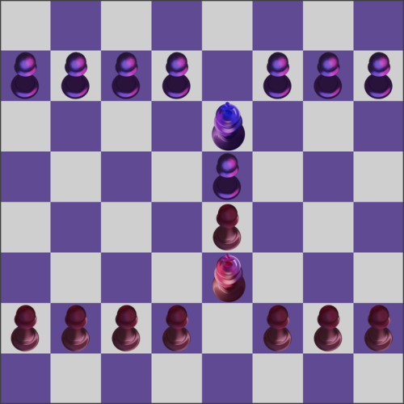

# BongcloudChess #

## Rules ##

* The game starts with the board in the double bongcloud position with only kings and pawns
* Pawns move (and capture) the same as with chess (barring en passant) as well as nothing happenning when they reach the other side
* Kings can move 1 space but only in its color's pawn direction or sideways
* The win-states are when `the oppenent's king is captured` or when `the king reaches the end of the board`
* Due to white moving first its a draw if black reaches the end the move after white
